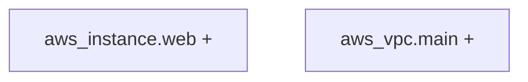

# Terraform Plan Visualizer

Turns Terraform plan output into visual diagrams and change summaries for PR reviews.

## What it does

- **Visual diagrams** - Shows resource relationships with Mermaid graphs
- **Change summaries** - Clear tables of creates, updates, replaces, destroys
- **Risk warnings** - Highlights dangerous operations
- **Sticky comments** - Updates existing PR comments instead of spamming
- **Automatic Terraform installation** - Installs the specified Terraform version

## Quick start

Add this to your `.github/workflows/terraform-plan.yml`:

```yaml
name: Terraform Plan Visualizer
on:
  pull_request:
    paths: ['**/*.tf', '**/*.tfvars']

permissions:
  contents: read
  pull-requests: write

jobs:
  visualize:
    runs-on: ubuntu-latest
    steps:
      - uses: actions/checkout@v4
      
      - name: Visualize Terraform Plan
        uses: GarvitBanga/tf-plan-visualizer@v0.1.0
        with:
          working-directory: infra
          max-destroy: 0
          max-replace: 2
        env:
          GITHUB_TOKEN: ${{ secrets.GITHUB_TOKEN }}
```

## Configuration

| Input | Description | Default |
|-------|-------------|---------|
| `working-directory` | Terraform files location | `.` |
| `terraform-version` | Terraform version to install | `1.7.5` |
| `max-destroy` | Max destroys allowed (0 = fail on any) | `0` |
| `max-replace` | Max replaces allowed | `0` |
| `var-file` | Variable files (comma-separated) | - |

**Note:** If counts exceed thresholds, the job fails to block the merge.

## Outputs

| Output | Description |
|--------|-------------|
| `comment-url` | URL of the posted PR comment |
| `create-count` | Number of resources to be created |
| `update-count` | Number of resources to be updated |
| `replace-count` | Number of resources to be replaced |
| `destroy-count` | Number of resources to be destroyed |
| `has-risk` | Whether the plan contains risky changes |

## Example output

The action generates PR comments like this:

**Resource Graph:**


**Change Summary:**
| Action | Count |
|--------|-------|
| + Create | 2 |

**Top Changes:**
- + `aws_instance.web` create
- + `aws_vpc.main` create

## Development

```bash
npm install
npm run build
npm test
```

## License

MIT 